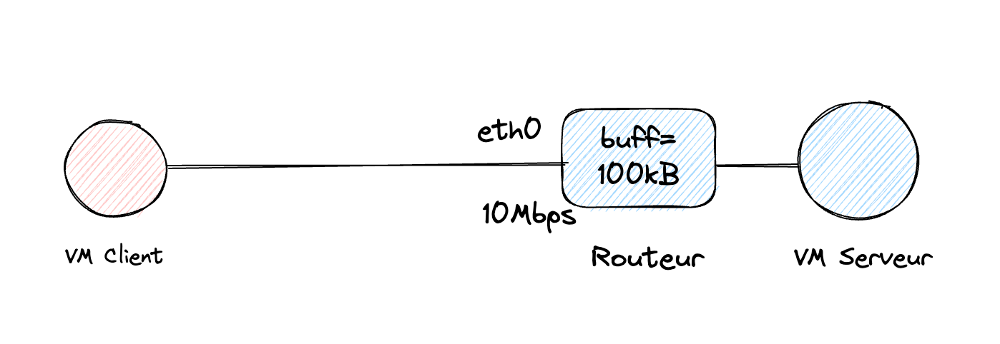
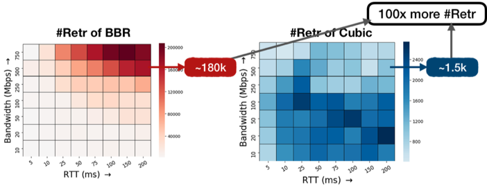
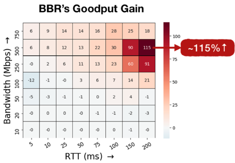

# Introduction


Dans ce lab, nous allons montrer les différences de comportement et de performance de plusieurs CCA suivant les conditions de RTT, Buffer et BW.

Pour cela, nous grapherons **cwnd** en nous basant sur la collecte des indicateurs systèmes du coté de l'émétteur.


Nous allons utiliser les données du kernel fournies par l'utilitaire Linux **ss** :

```
# ss -ein dst X.Y.Z.V
Netid         State          Recv-Q          Send-Q                    Local Address:Port                      Peer Address:Port         Process                                                                                                                                  
tcp           ESTAB          0               2082224                   172.232.47.90:58022                   X.Y.Z.V:5201          timer:(on,440ms,0) ino:178463 sk:9e cgroup:/user.slice/user-0.slice/session-5.scope <->
	 ts sack bbr wscale:6,7 rto:448 rtt:234.813/3.371 mss:1448 pmtu:1500 rcvmss:536 advmss:1448 **cwnd:200 ssthresh:88** bytes_sent:3162469 bytes_retrans:1116408 bytes_acked:1516094 segs_out:2187 segs_in:664 data_segs_out:2185 **bbr:(bw:6468224bps,mrtt:145.2,pacing_gain:1,cwnd_gain:2)** send 9866575bps lastrcv:4344 lastack:8 pacing_rate 6403544bps delivery_rate 4123200bps delivered:1293 busy:4040ms rwnd_limited:96ms(2.4%) unacked:366 retrans:56/771 lost:56 sacked:244 rcv_space:14480 rcv_ssthresh:64088 notsent:1552256 minrtt:145.2
tcp           ESTAB          0               1410352                   172.232.47.90:58036                   X.Y.Z.V:5201          timer:(on,448ms,0) ino:178464 sk:9f cgroup:/user.slice/user-0.slice/session-5.scope <->
	 ts sack bbr wscale:6,7 rto:448 rtt:236.288/3.617 mss:1448 pmtu:1500 rcvmss:536 advmss:1448 cwnd:114 ssthresh:54 bytes_sent:1726053 bytes_retrans:558928 bytes_acked:948478 segs_out:1195 segs_in:434 data_segs_out:1193 bbr:(bw:3747816bps,mrtt:145.467,pacing_gain:0.75,cwnd_gain:2) send 5588841bps lastsnd:8 lastrcv:4196 lastack:4 pacing_rate 2782752bps delivery_rate 2061296bps delivered:731 busy:4040ms rwnd_limited:64ms(1.6%) unacked:151 retrans:38/386 lost:40 sacked:74 rcv_space:14480 rcv_ssthresh:64088 notsent:1191704 minrtt:145.467
tcp           ESTAB          0               0                         172.232.47.90:58020                   X.Y.Z.V:5201          ino:178462 sk:a0 cgroup:/user.slice/user-0.slice/session-5.scope <->
	 ts sack cubic wscale:6,7 rto:416 rtt:155.131/41.42 ato:40 mss:1448 pmtu:1500 rcvmss:536 advmss:1448 cwnd:10 bytes_sent:160 bytes_acked:161 bytes_received:4 segs_out:9 segs_in:8 data_segs_out:3 data_segs_in:4 send 746724bps lastsnd:4640 lastrcv:3896 lastack:3896 pacing_rate 1493440bps delivery_rate 78104bps delivered:4 busy:484ms rcv_space:14480 rcv_ssthresh:64088 minrtt:148.314
tcp           ESTAB          0               1665200                   172.232.47.90:58044                   X.Y.Z.V:5201          timer:(on,464ms,0) ino:178465 sk:a1 cgroup:/user.slice/user-0.slice/session-5.scope <->
	 ts sack bbr wscale:6,7 rto:456 rtt:239.271/2.779 mss:1448 pmtu:1500 rcvmss:536 advmss:1448 cwnd:70 ssthresh:50 bytes_sent:1618901 bytes_retrans:532864 bytes_acked:893454 segs_out:1121 segs_in:365 data_segs_out:1119 bbr:(bw:2016832bps,mrtt:148.727,pacing_gain:1,cwnd_gain:2) send 3388961bps lastsnd:4 lastrcv:4048 pacing_rate 1996664bps delivery_rate 2236552bps delivered:696 busy:4044ms rwnd_limited:200ms(4.9%) unacked:133 retrans:25/368 lost:25 sacked:77 rcv_space:14480 rcv_ssthresh:64088 notsent:1472616 minrtt:148.727
```

# Etat du serveur IPerf

Un routeur (i.e une VM) est placé devant le serveur, en utilisant les scripts du répertoire [./rtr](./rtr)



Au début du lab, la bande passante au niveau du routeur est de 10Mbps avec un un buffer de 100ko.
```
:~# tc class show dev eth0
class htb 1:3 root leaf 3: prio 0 rate 10Mbit ceil 10Mbit burst 1600b cburst 1600b 
# tc qdisc show
qdisc noqueue 0: dev lo root refcnt 2 
qdisc htb 1: dev eth0 root refcnt 2 r2q 10 default 0x3 direct_packets_stat 2 direct_qlen 1000
qdisc bfifo 3: dev eth0 parent 1:3 limit 104857b
qdisc pfifo_fast 0: dev eth1 root refcnt 2 bands 3 priomap 1 2 2 2 1 2 0 0 1 1 1 1 1 1 1 1
```

L'IP publique du Routeur est @TARGET.
Mesurons le RTT du CLient vers @TARGET.

# Preparation du Client

Sur le Client (i.e votre VM linux dédiée), vous avez probablement déjà cloné le repository, plaçons-nous dans le bon répertoire :
```
git clone https://github.com/pragmatic-fermat/cubic-bbr.git
cd cubic-bbr/lab-graph/client
```

Désactivons l'historique et TSO dans les paramètres kernel :

```
chmod a+x prepare-kernel.sh
./prepare-kernel.sh
```

Installons les logiciels nécessaires (a priori déjà installés précedemment) :
```
apt update && apt install -y moreutils iperf3 python3-pandas nginx r-base-core r-cran-ggplot2
```

# Réalisation du "tir"

Dans 2 fenêtre sur le Client, executez :

## a) mesure de CWND en continu

Lançons le script de mesure du **cwnd** (basé sur ```ss``` ) dans un premier terminal

```
bash ss-output.sh @TARGET
```
## b) [OPTION] Capture de la trace (et récupération de celle-ci)

Il suffit de lancer le temps du tir :
```
tcpdump -n -s 96 -w trace.pcap "ip host @TARGET and tcp"
```

Le "-s 96" spécifie de ne capturer que les 96 premiers octets (largement suffisants)
La trace aura pour nom "trace.pcap"

A la fin de l'expérimentation, 
- faire Ctrl-C pour stopper la capture
- pour récuper le fichier pcap sur son PC, il suffit d'utiliser un site de transfert tel que [bashupload.com](https://bashupload.com/)

```
curl bashupload.com -T trace.pcap
```

Ce qui donne (par exemple)
```
=========================
Uploaded 1 file, 23 352 514 bytes

wget http://bashupload.com/g3VGp/vp-6s.pcap
=========================
```

**Attention** sur https://bashupload.com/, les fichiers sont limités à 50G, stockés seulement 3j, et ne peuvent être téléchargés qu'une seule fois.

## c) iperf vers la destination en spécifiant le CCA (ici RENO)

En parallèle, dans un second terminal, toujours sur la VM Client :

```
iperf3 -c @TARGET -P 3 -t 60 -C reno  
```

Le tir dure 60 sec. 

Lorsqu'il est fini, tappez (une seule fois) ```Ctrl-C``` dans le 1er terminal afin de stopper la collecte de données.

PS = ```@TARGET``` est fourni par l'animateur, c'est le routeur qui SNAT/DNAT ver le serveur, avec une application de bande-passante/delai/perte de paquet (voir [script de configuration](rtr/setup-bw.sh) )

PS2 : il est possible d'utiliser un script qui ajoute le calcul du début (tput) : [ss-output-add-tput.sh](client/ss-output-add-tput.sh)

Notez les *retries* dans les statistiques d'IPerf pour (in)valider le ratio BBR/CUBIC du tableau ci-dessous (c-a-d ~x 100) , tirés d'un [article de l'APNIC](https://blog.apnic.net/2020/01/10/when-to-use-and-not-use-bbr/) :




# Creation du graphe CWND pour une connexion

Depuis le 1er terminal, vérifier que les données sont bien enregistrées :
```
ls -lh sender-ss.*
tail sender-ss.txt
```

Créeons maintenant le graphe et copions-le à dans le *content-dir* du serveur web sur notre Client :
```
python3 create-png.py

cp sender-ss.png /var/www/html/
```

Visiter http://@IPClient/sender-ss.png

Analysez !! (en comparant les résultats obtenus pour les 3 modes de CCA : **reno**, **cubic** et **bbr**)

# Creation du graphe CWND pour 3 connexions

Rejouez les étapes précedentes avec le script de collecte ```bash ss-output-add**-tput**.sh @TARGET```

Cette fois-ci le script de génération d'image (svg) est en R :

```
Rscript ss-data-analysis-cwnd-vs-time-no-ssthresh.R
cp sender-ss.svg /var/www/html/
```

Visiter http://@IPClient/sender-ss.svg

Nous ajoutons un autre graphe : l'évolution du RTT dans le temps :
```
Rscript ss-data-analysis-rtt-vs-time.R
cp sender-ss-rtt-vs-time.svg /var/www/html/
```
Cette fois-ci c'est http://@IPClient/sender-ss-rtt-vs-time.svg qu'il faut visiter.

# Modification du buffer et de la bande passante au niveau du goulet d'étranglement

Nous allons maintenant modifier la BW et le buffer.

Proposez des valeurs de BW qui permettraient de vérifier les promesses du tableau BBR vs CUBIC ci-dessous :



[L'article](https://blog.apnic.net/2020/01/10/when-to-use-and-not-use-bbr/) précise que les buffers sont "shallow" (= 100KB)

---
PS : ce Lab est inspiré de [https://harshkapadia2.github.io/tcp-version-performance-comparison/](https://harshkapadia2.github.io/tcp-version-performance-comparison/).
