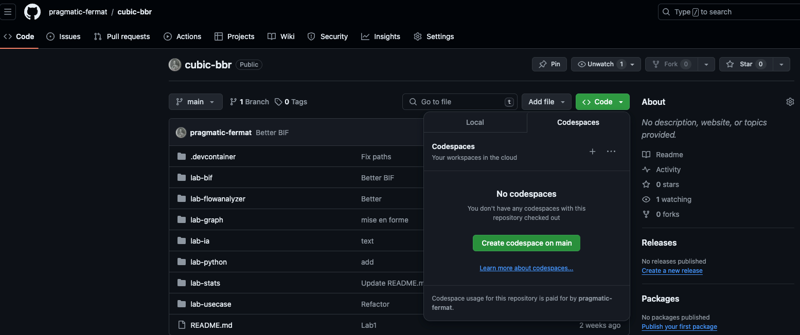
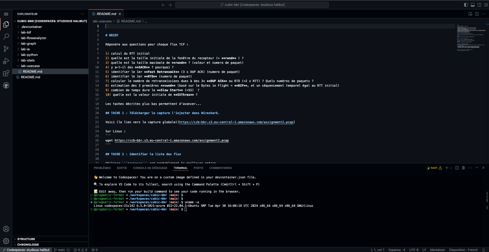

# Lab Mise en route

Lors de ces Labs, vous aurez 4 envrionnements de travail :

- **votre PC personnel** (en général sous Windows), sur lequel vous pourrez lancer Wireshark, voir les graphes,...

- **Une VM Linux** (personnel) dans le cloud sur lesquel vous pourrez faire des captures des calculs ,etc.. 

- **un accès Github CodeSpaces** (optionnel) qui permet d'avoir une console et un éditeur de fichier dans le contexte du repository (Cloud IDE).
Cet espace est accessible universellement en HTTPS mais nécessite un compte Gihtub (gratuit)

- un serveur **Linux avec GPU** pour pouvoir réaliser [le lab d'IA](../lab-ia/README.md) (seulement pendant quelques heures en raison de la dispo et du coût)


## VM linux dédiée

C'est une Ubuntu récente sur laquelle vous serez **root**

Le mieux est d'y installer un maximum d'outils au préalable
```
apt update
apt -y install tcptrace tshark python3  
apt -y install iperf3 moreutils nginx curl ethtool
apt -y install python3-pip libjpeg-dev
apt -y install python3-pandas python3-matplotlib
apt -y install r-base-core r-cran-ggplot2
apt -y install libpcap-dev
```

Cette VM est accessible en SSH avec une IP publique sur Internet (pratique pour publier des graphes et les visualiser depuis son PC !)
Le mot de passe root SSH vous sera fourni par l'animateur.

Cette VM sera accessible pendant toute la session.

## Contexte Github Codespaces

### Etape 1 : Créer un compte GitHub

[Github](https://github.com) fait office de SSO pour tout l'ecosysteme Cloud Native.  
Creez ou utilisez votre compte, pour vous connecter dans Github.

Maintenant que vous disposez d'un compte Github, il nous faut un environnement de travail, qui permet l'édition de fichiers et l'execution de commande. 

Pour cela nous allons utiliser un Cloud IDE , c'est à dire un environnement de developpement (c-a-d soit une VM soit un container sous-javent) accessible via notre navigateur.

### Etape 2 : Ouvrir un workspace dans Github CodeSpaces

Pour lancer un espace de travail `CodeSpaces`, il suffit de suivre les étapes indiquées dans les captures d'écran ci-dessous

A l'intérieur du répo https://github.com/pragmatic-fermat/cubic-bbr , sélectionnez la liste déroulante du bouton `Code`



L'espace de travail est prêt :


Si vous tentez de faire un copier/coller, vous devrez répondre "Oui" à cette invitation.

## VM linux GPU dédiée

L'installation préalable est explicitée dans le [le lab d'IA](../lab-ia/README.md).

Cette VM est accessible en SSH avec une IP publique sur Internet (pratique pour publier le site de Chat)
Le mot de passe root SSH vous sera fourni par l'animateur.