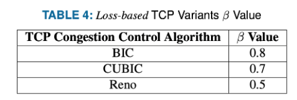

# Analyse statistique des suites de CWND

Ce lab a pour but d'utiliser un script python qui vise à déduire le beta de la suite de BIF observés (en supposant que cwnd=bif)
Le beta peut permettre d'identifier le CCA.


Des valeurs communes de beta sont :



Soit le fichier [assignment2.pcap](https://ccb-bbr.s3.eu-central-1.amazonaws.com/assignment2.pcap), lister les conversations TCP :

```
wget https://ccb-bbr.s3.eu-central-1.amazonaws.com/assignment2.pcap
tshark -q -z conv,tcp -n -r assignment2.pcap 
```

On constate que c'est très lent...
**tcptrace** est une meilleur alternative :
```
apt install -y tcptrace
```
puis :
```
# tcptrace assignment2.pcap 
1 arg remaining, starting with 'assignment2.pcap'
Ostermann's tcptrace -- version 6.6.7 -- Thu Nov  4, 2004

24125 packets seen, 24125 TCP packets traced
elapsed wallclock time: 0:00:01.017290, 23714 pkts/sec analyzed
trace file elapsed time: 0:00:08.320942
TCP connection info:
  1: nrgws2.nrg.cs.stonybrook.edu:43498 - 128.208.2.198:80 (a2b) 6977> 4129<  (complete)
  2: nrgws2.nrg.cs.stonybrook.edu:43500 - 128.208.2.198:80 (c2d) 7068> 4766<  (complete)
  3: nrgws2.nrg.cs.stonybrook.edu:43502 - 128.208.2.198:80 (e2f)  729>  456<  (complete)
```

## Utilisation de tcpdump pour decouper les pcap

Choisir une conversation et construire un filtre (par ex "tcp.scrport==80 and tcp.dstport==43500)
```
tcpdump -n -r assignment2.pcap -w tcp-43500.pcap "tcp port 43500"
```
Là aussi la méthode est laborieuse.

## Utilisation de Pcap-Splitter

Utilisons un outil plus adapté : (Pcap-Splitter)[https://github.com/shramos/pcap-splitter?tab=readme-ov-file] :

Installons d'abord les dépendances
```
wget https://github.com/seladb/PcapPlusPlus/releases/download/v23.09/pcapplusplus-23.09-ubuntu-22.04-gcc-11.2.0-x86_64.tar.gz
tar zxvf pcapplusplus-23.09-ubuntu-22.04-gcc-11.2.0-x86_64.tar.gz 
cd pcapplusplus-23.09-ubuntu-22.04-gcc-11.2.0-x86_64/
cp -r /bin/* /usr/local/sbin/
```

Puis, installons l'outil
```
cd /root/
git clone https://github.com/shramos/pcap-splitter.git
cd pcap-splitter
```

Téléchargeons le pcap global et créeons un sous-repertoire pour les résultats :
```
wget "https://ccb-bbr.s3.eu-central-1.amazonaws.com/assignment2.pcap"
mkdir subpcaps
```

Nous pouvons enfin, appeller notre module python **pcap-splitter** depuis son répertoire, et crer les captures individuelles dans le sous-répertoire **subcaps**  :
```
python3
>>> from pcap_splitter.splitter import PcapSplitter
>>>ps = PcapSplitter("./assignment2.pcap")
>>> print(ps.split_by_session("subpcaps", pkts_bpf_filter="tcp"))
Started...
Finished. Read and written 24125 packets to 3 files
>>> exit()
```

On obtient :
```
ls -lh subcaps
total 23M
-rw-r--r-- 1 root root  11M May 11 20:42 assignment2-0001.pcap
-rw-r--r-- 1 root root  11M May 11 20:42 assignment2-0002.pcap
-rw-r--r-- 1 root root 1.1M May 11 20:42 assignment2-0003.pcap
```

## Affichage des ACK_RTT

Travaillons maintenant sur une des sous-pcap en utilisant tshark pour afficher en colonne les ACK_RTT :
```
tshark -r subpcaps/assignment2-0003.pcap -T fields -e frame.time_relative  -e tcp.analysis.ack_rtt > desta-rtt.txt 
cat desta-rtt.txt 
```

## Utilisation du script tcp_variant_individual.py

Télécharger le script ```tcp_variant_individual.py```.
```
wget https://raw.githubusercontent.com/pragmatic-fermat/cubic-bbr/main/lab-stats/tcp_variant_individual.py
```
Le lire et le comprendre...
L'utiliser sur nos données.

Quelques pistes :
- le script attend en entrée un fichier CSV
-  en première colonne , il attend **cwnd**
- ```tshark -r subpcaps/assignment2-0003.pcap -T fields -e frame.time_relative  -e tcp.analysis.bytes_in_flight > bif.txt``` permet d'extrait les BIF
- ```sed -i 's/\s/,/g' bif.txt```  permet de remplacer les espaces par une virgule (et donc do'btenir un CSV)
- ```python3 tcp_variant_individual.py bif.txt``` permet de le lancer

Voici ce qu'on peut obtenir :
```
===============================================================
Length of Beta Values: 128
Median of the Beta Values:0.98
Sum of Beta Values:123.12
Average of Beta Values:0.96
TCP Variant: BIC TCP Variant
===============================================================
```

Je laisse le lecteur conclure quant à la fiabilité d'un tel script...

---
PS : ce Lab est inspiré de [https://github.com/desta161921/TCP-Protocol-Related](https://github.com/desta161921/TCP-Protocol-Related)
